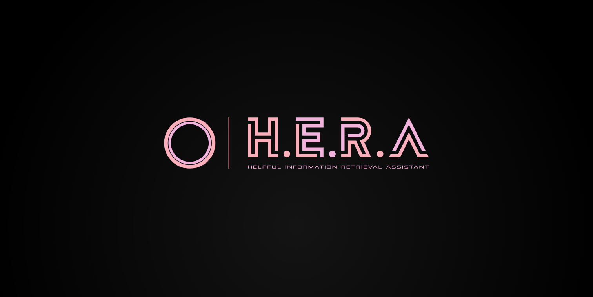

<div align="center" id="top"> 
  

  &#xa0;

  <!-- <a href="https://odin.netlify.app">Demo</a> -->
</div>

<h1 align="center">H.E.R.A</h1>

<p align="center">
  

  

  

  

  

  

  
</p>

Status

<h4 align="center"> 
	🚧  Hera 🚀 Under construction...  🚧
</h4> 

<hr>

<p align="center">
  <a href="#dart-about">About</a> &#xa0; | &#xa0;
  <a href="#sparkles-works">How It Works</a> &#xa0; | &#xa0;
  <a href="#hammer-features">Installation</a> &#xa0; | &#xa0;
  <a href="#rocket-technologies">Technologies</a> &#xa0; | &#xa0;
  <a href="#white_check_mark-requirements">Requirements</a> &#xa0; | &#xa0;
  <a href="#checkered_flag-starting">Getting Started</a> &#xa0; | &#xa0;
  <a href="#memo-license">License</a> &#xa0; | &#xa0;
  <a href="https://github.com/BNkosi" target="_blank">Author</a>
</p>

<br>

## :dart: About ##

### :question::exclamation: Problem Statement ###

[](https://youtu.be/gsDucStJIJw)

<a href="https://www.explore-datascience.net">Explore Data Science Academy</a> is an amazing company helping South Africas youth do amazing things. This repository is a testament to that. Explore is an educational institution in the information systems development field.

Student enquiries are an administrative burden on the company. For reasons which are little understood, users cannot find information on the website and require human assistance.

Hera aims to address this issue by creating an information retrieval assistant to act as the first trouble shooting step before contacting a member of staff.

## :sparkles: How It Works ##

## :hammer: Installation ##

:heavy_check_mark: Feature 1;\
:heavy_check_mark: Feature 2;\
:heavy_check_mark: Feature 3;

## :rocket: Technologies ##

The following tools were used in this project:

- [Expo](https://expo.io/)
- [Node.js](https://nodejs.org/en/)
- [React](https://pt-br.reactjs.org/)
- [React Native](https://reactnative.dev/)
- [TypeScript](https://www.typescriptlang.org/)

## :white_check_mark: Requirements ##

Before starting :checkered_flag:, you need to have [Git](https://git-scm.com) and [Node](https://nodejs.org/en/) installed.

## :checkered_flag: Getting Started ##

```bash
# Clone this project
$ git clone https://github.com/{{YOUR_GITHUB_USERNAME}}/odin

# Access
$ cd odin

# Install dependencies
$ yarn

# Run the project
$ yarn start

# The server will initialize in the <http://localhost:3000>
```

## :memo: License ##

This project is under license from MIT. For more details, see the [LICENSE](LICENSE.md) file.


Made with :heart: by <a href="https://github.com/{{YOUR_GITHUB_USERNAME}}" target="_blank">{{YOUR_NAME}}</a>

&#xa0;

<a href="#top">Back to top</a>
